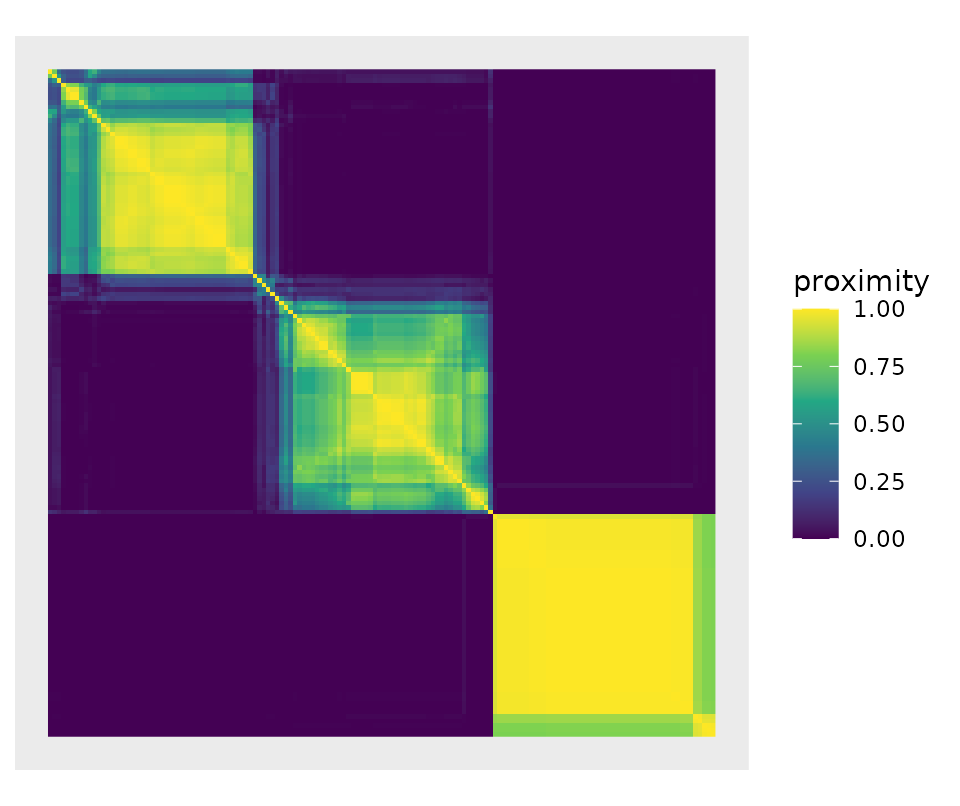

# Proximity matrices as statistical objects

A random forest partitions the predictor space many times over. Two
observations that keep landing in the same leaf are, as far as the
forest is concerned, the same kind of observation. Collecting that
co-occurrence over every tree gives the *proximity matrix*

``` math
P_{ij} = \frac{1}{B} \sum_{b=1}^{B} \mathbb{I}\left[\ell_b(x_i) = \ell_b(x_j)\right],
```

where $`\ell_b(x)`$ is the leaf of tree $`b`$ reached by $`x`$.

Most implementations treat $`P`$ as a by-product, handed back on request
and otherwise ignored. `Proximum` treats it as the object of interest.

## Extracting a proximity matrix

``` r

library(Proximum)

set.seed(1)
rf <- randomForest::randomForest(
  Species ~ ., data = iris, ntree = 200, keep.inbag = TRUE
)

px <- proximity(rf, newdata = iris)
px
#> <proximity> 150 x 150 
#>   engine : randomForest 
#>   trees  : 200 
#>   type   : inbag
```

`randomForest` does not keep its training data, so `newdata` has to be
supplied.

A warning about the matrix `randomForest` hands back on its own. Its
signature reads `oob.prox = proximity`, so a forest fitted with
`proximity = TRUE` and nothing else stores the **out-of-bag** matrix,
not the in-bag one, and the fit records nothing that says which.
`Proximum` recovers the flag from the call and refuses to relabel the
matrix behind your back:

``` r

rf_stored <- randomForest::randomForest(
  Species ~ ., data = iris, ntree = 50, proximity = TRUE
)
proximity(rf_stored) # asks for in-bag; the forest has out-of-bag
#> Error:
#> ! The forest stores an out-of-bag proximity matrix, but `type = "inbag"` was requested. Pass `newdata` so that the matrix can be recomputed.
```

## Diagnostics

[`summary()`](https://rdrr.io/r/base/summary.html) reports what the
matrix looks like and whether the dissimilarity it induces can be
embedded in a Euclidean space, the condition under which classical
multidimensional scaling of the proximity is exact rather than
approximate.

``` r

summary(px)
#> <proximity> summary
#>   observations : 150 
#>   engine       : randomForest ( 200 trees )
#>   type         : inbag 
#>   off-diagonal :
#>   0%  25%  50%  75% 100% 
#> 0.00 0.00 0.00 0.59 1.00 
#>   exact zeros  : 58.9% 
#>   euclidean    : TRUE
```

The matrix is mostly zeros. That is not a defect: most pairs of irises
never share a leaf, and the sparsity is what makes the block structure
of the matrix informative.

## In-bag against out-of-bag

The definition above averages over *all* trees, including the trees that
were fitted on $`i`$ and $`j`$. Those trees have seen both observations
and are inclined to separate them correctly, which inflates the
proximity of same-class pairs. Restricting the average to the trees for
which both observations are out-of-bag removes that bias.

``` r

px_oob <- proximity(rf, newdata = iris, type = "oob")
px_oob
#> <proximity> 150 x 150 
#>   engine : randomForest 
#>   trees  : 200 
#>   type   : oob
```

The two matrices agree closely here, because 200 trees leave every pair
out-of-bag together in plenty of trees:

``` r

cor(px[upper.tri(px)], px_oob[upper.tri(px_oob)])
#> [1] 0.9865174
```

With few trees the out-of-bag denominator can be empty for some pairs.
Those entries come back as `NA`, not as `0`: the forest has no evidence
about the pair, which is a different statement from “the pair is
maximally dissimilar”.

``` r

set.seed(1)
small <- randomForest::randomForest(
  Species ~ ., data = iris, ntree = 3, keep.inbag = TRUE
)
sum(is.na(proximity(small, newdata = iris, type = "oob")))
#> [1] 14668
```

## The out-of-bag proximity is not a kernel

Debiasing the proximity costs something, and the price is worth stating
plainly. Stack the leaf indicators of all $`B`$ trees into one matrix
$`Z`$, with a column per leaf. Two observations share a leaf exactly
when they agree in that column, so the in-bag proximity is

``` math
P = \frac{1}{B} Z Z^{\top},
```

a Gram matrix over $`B`$. It is therefore positive semi-definite, and
$`\sqrt{1 - P}`$ is Euclidean. (This identity is also why `Proximum`
computes the matrix with a sparse cross-product instead of a loop over
trees: the same formula that settles the geometry is two orders of
magnitude faster to evaluate.)

The out-of-bag proximity masks $`Z`$ to the out-of-bag entries and
divides by the number of trees in which each *pair* was jointly
out-of-bag. With $`M`$ the out-of-bag mask,

``` math
P^{\text{oob}} = \left( Z_{\text{oob}} Z_{\text{oob}}^{\top} \right) \oslash \left( M M^{\top} \right),
```

an elementwise quotient of two Gram matrices. The Hadamard quotient of
two positive semi-definite matrices need not be positive semi-definite,
and here it is not:

``` r

c(
  inbag = min(eigen(unclass(px), symmetric = TRUE, only.values = TRUE)$values),
  oob   = min(eigen(unclass(px_oob), symmetric = TRUE, only.values = TRUE)$values)
)
#>         inbag           oob 
#> -1.265658e-14 -6.469597e-01
```

The in-bag minimum is zero up to rounding; the out-of-bag one is not
close to it. [`summary()`](https://rdrr.io/r/base/summary.html) reports
this rather than letting it pass silently:

``` r

summary(px)$euclidean
#> [1] TRUE
summary(px_oob)$euclidean
#> [1] FALSE
```

This matters downstream. Classical multidimensional scaling of the
out-of-bag dissimilarity has negative eigenvalues, so its
low-dimensional configuration is an approximation of something that has
no exact Euclidean representation, and any method that assumes a kernel,
centered kernel alignment included, needs an explicit correction first.
Choose `type = "oob"` for an unbiased estimate of the proximities
themselves, and `type = "inbag"` when you need the geometry.

When you need both, [`make_psd()`](../reference/make_psd.md) projects
the out-of-bag matrix onto the cone of positive semi-definite matrices
and records what it did:

``` r

repaired <- make_psd(px_oob, method = "clip")
repaired
#> <proximity> 150 x 150 
#>   engine : randomForest 
#>   trees  : 200 
#>   type   : oob 
#>   repaired: clip ( smallest eigenvalue was -0.647 )
summary(repaired)$euclidean
#> [1] TRUE
```

Three corrections are offered. `"clip"` discards the negative directions
and is the nearest positive semi-definite matrix in Frobenius norm;
`"flip"` keeps them with their sign reversed; `"shift"` adds a constant
to the diagonal, which is the only one of the three that leaves every
off-diagonal proximity exactly where it was. None is right in general,
which is why the choice is yours and is recorded on the object.

## Other engines

The proximity is a property of the ensemble, not of the package that
fitted it. `Proximum` extracts it from `ranger` with the same
definitions and the same out-of-bag handling:

``` r

set.seed(1)
rg <- ranger::ranger(Species ~ ., data = iris, num.trees = 200, keep.inbag = TRUE)
proximity(rg, newdata = iris)
#> <proximity> 150 x 150 
#>   engine : ranger 
#>   trees  : 200 
#>   type   : inbag
```

Because both engines produce the same object, “do two implementations of
the same forest represent the data the same way?” becomes a question the
inference layer can answer, rather than a question nobody can ask.

## From proximity to dissimilarity

``` r

d <- as.dist(px)
mds <- cmdscale(d, k = 2)
plot(mds, col = iris$Species, pch = 19, xlab = "", ylab = "",
     main = "MDS of the forest proximity")
```



## What comes next

The inference layer, which compares two proximity matrices with a Mantel
test, partitions their variation with PERMANOVA and aligns them with
CKA, is the subject of
[`vignette("comparing-forests")`](../articles/comparing-forests.md).
Scaling past a few thousand observations is the subject of
[`vignette("large-n")`](../articles/large-n.md).
