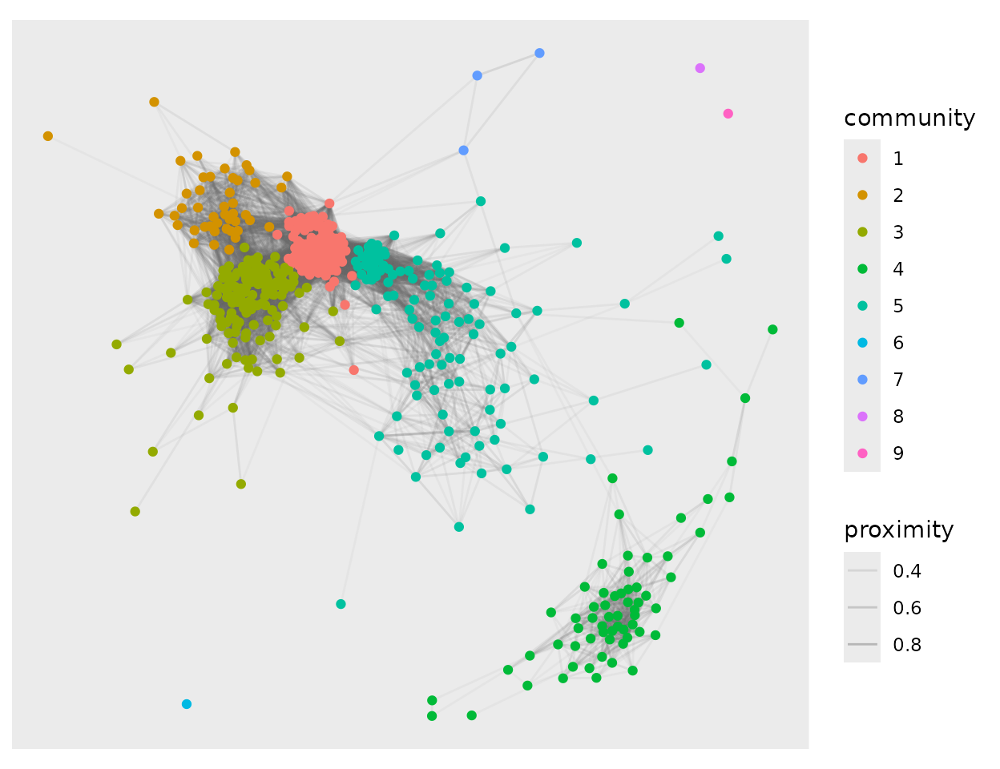

# A credit scoring case study

Credit scoring is the running example across `Proximum`, `rankimp` and
`e2tree`, for three reasons. The regulatory context makes explanation a
requirement rather than a nicety; the data are large enough that the
$`O(n^2)`$ cost of a proximity matrix bites; and the predictors are
correlated enough that different importance measures genuinely disagree.

The portfolio here is synthetic. Public credit panels that can be
redistributed have had the protected attributes stripped out of them,
and the third question below cannot be asked without one.
[`?loans`](../reference/loans.md) records what was built into the data
and `inst/data-raw/loans.R` is the specification as code. Read the
numbers as a demonstration of what the diagnostics say, not as a fact
about consumer lending.

``` r

library(Proximum)
library(randomForest)
#> randomForest 4.7-1.2
#> Type rfNews() to see new features/changes/bug fixes.

str(loans, give.attr = FALSE)
#> 'data.frame':    2000 obs. of  13 variables:
#>  $ default        : Factor w/ 2 levels "no","yes": 1 1 1 1 1 1 1 2 1 1 ...
#>  $ amount         : num  8125 4425 29275 15675 8675 ...
#>  $ income         : num  27233 30134 115880 47298 58451 ...
#>  $ dti            : num  0.436 0.255 0.385 0.562 0.397 0.447 0.532 0.305 0.487 0.6 ...
#>  $ term           : Factor w/ 2 levels "36 months","60 months": 2 1 2 1 1 2 1 1 1 1 ...
#>  $ employment     : num  6 7 17 0 3 3 2 10 5 9 ...
#>  $ score          : num  720 673 644 758 553 748 696 582 622 598 ...
#>  $ utilisation    : num  0.352 0.445 0.566 0.345 0.367 0.721 0.157 1 0.245 0.498 ...
#>  $ delinquencies  : int  0 2 0 0 0 0 0 0 0 1 ...
#>  $ home           : Factor w/ 3 levels "rent","mortgage",..: 3 3 2 2 2 1 1 1 2 2 ...
#>  $ purpose        : Factor w/ 5 levels "debt consolidation",..: 5 1 1 1 1 2 1 1 1 1 ...
#>  $ vintage        : Factor w/ 4 levels "2019","2020",..: 1 1 1 1 1 1 1 1 1 1 ...
#>  $ applicant_group: Factor w/ 2 levels "A","B": 1 1 1 1 2 1 1 2 2 2 ...
```

Two columns are not predictors. `vintage` is the origination year, held
back for the second question, and `applicant_group` is a protected
attribute that the model is not allowed to see and that the third
question is about.

``` r

predictors <- setdiff(names(loans), c("applicant_group", "vintage"))

set.seed(1)
rows <- sample(nrow(loans), 500)
book <- loans[rows, ]

rf <- randomForest(default ~ ., data = book[, predictors], ntree = 500)
px <- as_proximity(rf, newdata = book[, predictors])
summary(px)
#> <proximity> summary
#>   observations : 500 
#>   engine       : randomForest ( 500 trees )
#>   type         : inbag 
#>   off-diagonal :
#>    0%   25%   50%   75%  100% 
#> 0.000 0.006 0.046 0.146 0.984 
#>   exact zeros  : 13.8% 
#>   euclidean    : TRUE
```

## 1. Are there segments, and are they risk segments?

A lender’s segments are drawn by hand: thin file, high utilisation,
short tenure. The forest draws its own, and they are in the proximity
rather than in any coefficient. `autoplot(type = "network")` keeps the
pairs the forest puts above a threshold and reads the communities of the
graph that remain.

``` r

set.seed(11)
picture <- autoplot(px, type = "network", threshold = 0.2)
picture
```



The communities are not labelled with anything the forest was told.
Whether they are risk segments is a question to be asked of them
afterwards:

``` r

community <- picture$layers[[2]]$data$community
segments <- aggregate(
  cbind(default == "yes", score, utilisation) ~ community,
  data.frame(community, book), mean
)
names(segments) <- c("community", "default_rate", "score", "utilisation")
segments$n <- as.vector(table(community))
segments[order(-segments$default_rate), ]
#>   community default_rate    score utilisation   n
#> 6         6  1.000000000 646.0000   0.6230000   1
#> 8         8  1.000000000 658.0000   0.2110000   1
#> 9         9  1.000000000 593.0000   0.1830000   1
#> 4         4  0.873015873 614.3968   0.8391746  63
#> 7         7  0.333333333 648.6667   0.9150000   3
#> 5         5  0.085470085 617.6325   0.4872222 117
#> 2         2  0.066666667 712.1778   0.8326444  45
#> 3         3  0.059701493 723.2313   0.4435970 134
#> 1         1  0.007407407 722.8222   0.5205111 135

mean(book$default == "yes")
#> [1] 0.162
```

Read the table rather than this paragraph for the figures, since a
community label is a clustering of a particular fit and the exact counts
move with the seed. What does not move is the shape of it. One community
of about sixty borrowers defaults at close to nine in ten, against a
book rate of one in six. It is neither the low-score community nor the
high-utilisation community: its mean score sits near 614 and its mean
utilisation near 0.84, while the two communities that have one of those
without the other default at well under a tenth. The forest has found an
interaction, and the proximity shows it as a block, because a block of
observations the model keeps together is what an interaction looks like
once you stop reading coefficients.

Some communities hold a single borrower. Those are not segments, they
are what a threshold of 0.2 leaves isolated, and reporting them as
segments would be reading the threshold rather than the data.

## 2. Does the structure survive a shift in the window?

The portfolio spans four origination years and the relationship moves
across them: by construction, utilisation carries three times the weight
in 2022 that it carries in 2019. A lender who refits annually wants to
know whether the model has reorganised its view of the book or merely
re-estimated it.

The question cannot be answered by comparing two proximity matrices on
different borrowers. It is answered by applying both forests to the
*same* borrowers and comparing what each makes of them:

``` r

early <- loans$vintage %in% c("2019", "2020")
late  <- loans$vintage %in% c("2021", "2022")

set.seed(3)
held <- loans[late, ][sample(sum(late), 400), ]

forest_on <- function(subset, seed) {
  set.seed(seed)
  randomForest(default ~ ., data = loans[subset, predictors], ntree = 500)
}
represent <- function(fit) as_proximity(fit, newdata = held[, predictors])
```

A difference is only a difference against the noise floor, and the noise
floor here is how much two refits of the same window disagree:

``` r

replicates <- lapply(1:4, function(i) represent(forest_on(early, 100 + i)))
stability(replicates)
#> <proximity_stability>
#>   replicates : 4 on 400 observations
#>   statistic  : mantel 
#>   comparisons: 6 pairs of replicates
#>   median     : 0.9906 
#>   95% percentile interval: 0.9902 to 0.9909
```

Four refits of the early window agree with each other at a Mantel
correlation of 0.99, and the six pairwise comparisons span 0.990 to
0.991. That is the floor. Now the two windows:

``` r

mantel_test(represent(forest_on(early, 1)),
            represent(forest_on(late, 2)), n_perm = 999)
#> 
#>  Mantel test (pearson, 999 permutations of the observations)
#> 
#> data:  represent(forest_on(early, 1)) and represent(forest_on(late, 2))
#> r = 0.8582, pairs = 79800, permutations = 999, p-value = 0.001
#> alternative hypothesis: greater
```

0.86, against a floor of 0.99. The two forests are far from independent,
which is the expected part: they are fitted to the same kind of borrower
and agree on the broad ordering. But the gap is many times the spread
between refits, so the answer to the question is that the forest does
reorganise, and the monitoring that would catch it is a Mantel
correlation against last year’s model rather than a comparison of
accuracies, which would have shown nothing.

## 3. What is the protected attribute worth to the model that never saw it?

`applicant_group` was not in the formula. It affects the default
probability nowhere in the generating process. It does shift the income
and the score, which are in the formula, so the question is whether the
representation the forest builds separates the groups anyway, and by how
much.

\[[`permanova()`](../reference/permanova.md)\] partitions the variation
in the proximity across the terms of a design, so the outcome and the
attribute can be entered together and the attribute read after the
outcome is accounted for:

``` r

permanova(px, ~ default + applicant_group, data = book, n_perm = 999)
#> Permutation test for the proximity dissimilarity
#> Terms added sequentially (first to last), 999 permutations of the observations
#> Dissimilarity: sqrt(1 - P) on px
#> Model: ~default + applicant_group
#>                  Df SumOfSqs      R2       F Pr(>F)    
#> default           1    6.926 0.03095 15.9403  0.001 ***
#> applicant_group   1    0.930 0.00415  2.1392  0.002 ** 
#> Residual        497  215.947 0.96490                   
#> Total           499  223.803 1.00000                   
#> ---
#> Signif. codes:  0 '***' 0.001 '**' 0.01 '*' 0.05 '.' 0.1 ' ' 1
```

The outcome accounts for 3.1 per cent of the variation in how the forest
arranges the borrowers. The attribute the model never received accounts
for a further 0.4 per cent, and that share is reliably not zero: across
999 permutations of the borrowers, at most one reproduced it.

Read the two numbers together and neither alone. 0.4 per cent is small,
and a diagnostic that called it alarming would be worthless the first
time it met a real portfolio. What it is not is zero, and it is measured
on a model that was never given the attribute, on data where the
attribute causes nothing. This is the leakage that comes free with
correlated predictors, and its size is the thing worth tracking between
refits.

## What this does not show

The proximity is a description of the model, not of the borrowers.
Everything above is a statement about how this forest arranges this
book, and a different forest on the same book will arrange it
differently, which is what the first part of question 2 measures. None
of it is a statement about who defaults, and none of it is a fairness
certificate: a [`permanova()`](../reference/permanova.md) that reports
0.4 per cent has measured one thing about one representation, and the
question of whether a lending decision is fair is not settled by a
percentage.
