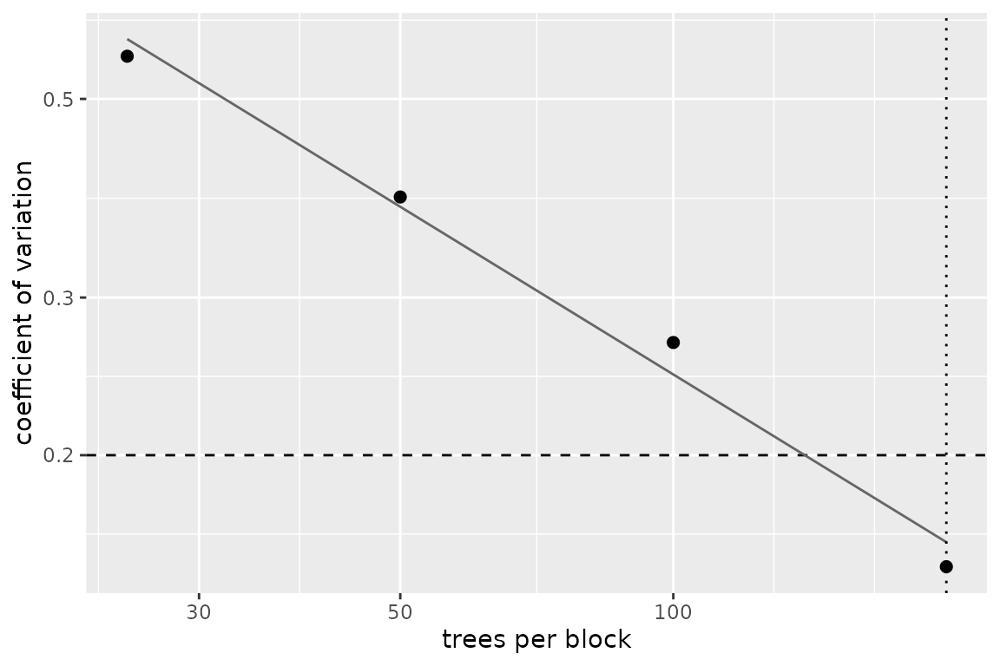
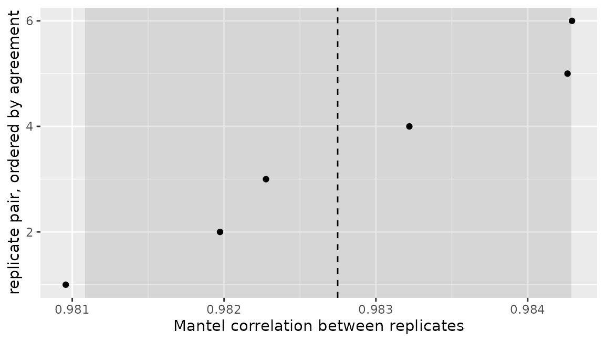

# Proximity matrices when n is large

A proximity matrix is $`n \times n`$. At $`n = 10^4`$ that is 800 MB in
double precision; at $`n = 10^5`$ it is 80 GB. The ensemble happily fits
data at both sizes, so the matrix, not the model, is what makes the
method unusable. This is not a hypothetical: it is the wall the `e2tree`
work hit on the Fannie Mae and HMDA data.

Two ways round it are implemented, and they give up different things. A
third is not, and is described at the end for what it is.

``` r

library(Proximum)
library(randomForest)
#> randomForest 4.7-1.2
#> Type rfNews() to see new features/changes/bug fixes.

set.seed(1)
n <- 600
X <- data.frame(matrix(rnorm(n * 6), n, 6))
y <- factor(ifelse(X$X1 + X$X2 + rnorm(n) > 0, "a", "b"))
training <- cbind(X, y = y)

forest <- randomForest(y ~ ., data = training, ntree = 500)
px <- as_proximity(forest, newdata = training)
format(object.size(px), units = "auto")
#> [1] "2.8 Mb"
```

## Sparsity: keep every value above a threshold

Thresholding and storing the result as a sparse matrix is lossless for
every pair above the threshold and stores nothing for the pairs below
it.

``` r

sp <- sparsify(px, threshold = 0.05)
sp
#> <proximity_sparse> 600 x 600 
#>   engine   : randomForest 
#>   trees    : 500 
#>   type     : inbag 
#>   threshold: 0.05 
#>   stored   : 20.4% of entries
```

``` r

summary(sp)
#> <proximity_sparse> summary
#>   observations : 600 
#>   engine       : randomForest ( 500 trees )
#>   type         : inbag 
#>   threshold    : 0.05 
#>   stored       : 73452 entries, 20.4% of the matrix
#>   pairs kept   : 36426 
#>   stored values:
#>    0%   25%   50%   75%  100% 
#> 0.052 0.080 0.130 0.220 0.864
```

The saving is real. What it is not is durable:

``` r

c(
  dense = format(object.size(px), units = "auto"),
  sparse = format(object.size(sp), units = "auto")
)
#>      dense     sparse 
#>   "2.8 Mb" "514.4 Kb"
```

The result is a `proximity_sparse`, not a `proximity`, and no statistic
in the package will take it:

``` r

mantel_test(sp, px, n_perm = 99)
#> Error:
#> ! `px1` holds a sparse proximity. The statistics in this package run on the induced dissimilarity or on the doubly centred matrix, and both are dense whatever the proximity was, so the thresholding would be undone inside this call and paid for nothing. Pass `as.matrix()` of it to say that this is what you want.
```

That refusal is the point rather than an omission. Every statistic here
runs on the induced dissimilarity or on the doubly centred matrix, and
both are dense whatever the proximity was: $`1 - P`$ turns every stored
zero into a one, and the Gower centring leaves no zero at all.

``` r

dissimilarity <- as_dissimilarity(px)
c(
  proximity = mean(as.matrix(px) != 0),
  dissimilarity = mean(dissimilarity != 0),
  centred = mean(double_centre(dissimilarity) != 0)
)
#>     proximity dissimilarity       centred 
#>     0.6238278     0.9983333     1.0000000
```

So [`sparsify()`](../reference/sparsify.md) is a storage format. Use it
to hold a matrix between sessions or to hand it to something outside the
package; [`as.matrix()`](https://rdrr.io/r/base/matrix.html) spends the
memory back when you want the statistics.

## Landmarks: the Nystrom approximation

Compute the proximity exactly against $`m \ll n`$ landmark observations,
then extend it to the rest by projection:

``` math
\tilde{P} = P_{n,m}\, P_{m,m}^{-1}\, P_{m,n}.
```

Nothing of size $`n \times n`$ is ever formed, on the way in or on the
way out.

``` r

approximation <- nystrom(forest, training, landmarks = 60, strata = training$y)
approximation
#> <proximity_nystrom> 600 x 600 
#>   engine   : randomForest 
#>   trees    : 500 
#>   type     : inbag 
#>   landmarks: 60 of 600 
#>   rank     : 60  
#>   stored   : 281.5 Kb against 2.7 Mb dense
```

Stratifying the landmark sample on the response is what keeps a rare
class represented, and it is the argument to reach for when one class is
small.

``` r

summary(approximation)
#> <proximity_nystrom> summary
#>   observations   : 600 
#>   engine         : randomForest ( 500 trees )
#>   landmarks      : 60 of 600 
#>   rank           : 60 ( 0 dropped at tol 1e-08 )
#>   off-diagonal   : mean 0.03356  sd 0.06818 
#>   diagonal error : 0.707 (exact would be 0)
#>   memory         : 281.5 Kb against 2.7 Mb dense
```

`diagonal error` is the price. The approximation has
$`\tilde{P}_{ii} \ne 1`$, where an exact proximity has one, and that
departure is the cheapest single measure of how much the landmarks
failed to span the sample. It falls as the landmarks are added:

``` r

sapply(c(20, 60, 180), function(m) {
  summary(nystrom(forest, training, landmarks = m))$diagonal_error
})
#> [1] 0.8440053 0.7174950 0.4666236
```

### What the approximation is for

Unlike the sparse form, this one survives being used, because the
question it answers is the geometric one. The configuration comes out of
the stored factor at $`O(nr^2)`$ instead of $`O(n^3)`$, and
[`protest()`](../reference/protest.md) takes the object directly:

``` r

coordinates <- embedding(approximation, k = 2)
dim(coordinates)
#> [1] 600   2

protest(approximation, px, n_perm = 199)
#> 
#>  Procrustes correlation (PROTEST, 2 dimensions, 199 permutations)
#> 
#> data:  approximation and px
#> r = 0.98183, dimensions = 2, permutations = 199, p-value = 0.005
#> alternative hypothesis: greater
```

The pairwise statistics still refuse it, for the same reason as before:
there is no matrix to correlate entry by entry without building one.

``` r

cka(approximation, px)
#> Error:
#> ! `px1` holds a Nystrom approximation, which is stored as a factor and has no matrix to compare entry by entry. Reconstructing it here would allocate the 600 by 600 object the approximation exists to avoid. `embedding()` and `protest()` work on the factored form; `as.matrix()` reconstructs it deliberately.
```

## How many trees, and how much does the answer move?

Neither of the above helps if the matrix is unstable, and the number of
trees that settles it is a question with an answer.

``` r

required <- n_trees_required(forest, training, eps = 0.2)
required
#> <proximity_trees>
#>   target  : CV below 0.2 
#>   searched: 25 to 200 trees per block, 4 block sizes 
#>   answer  : 200 trees per block, at CV 0.15
attr(required, "path")
#>   trees replicates        cv
#> 1    25         20 0.5580558
#> 2    50         10 0.3885353
#> 3   100          5 0.2672441
#> 4   200          2 0.1501387
```

[`autoplot()`](https://ggplot2.tidyverse.org/reference/autoplot.html)
draws the search it recorded: the criterion against the block size on
log axes, with the target, the answer, and the power law fitted through
the measured points.

``` r

autoplot(required)
```



The answer is an integer and goes on behaving as one, so it can be
handed straight back to the engine that raised the question:

``` r

required + 100L
#> [1] 300
```

The criterion falls as a power of the block size, so a target set too
low is not reached by any ensemble you would fit. When that happens the
result is `NA` and the projection says what it would take:

``` r

unreachable <- n_trees_required(forest, training, eps = 0.01)
c(answer = unreachable, projected_trees = attr(unreachable, "projected"))
#>          answer projected_trees 
#>              NA           20129
```

[`stability()`](../reference/stability.md) asks the same question of
replicates you already hold, and makes no assumption about where they
came from:

``` r

replicates <- lapply(1:4, function(i) {
  as_proximity(randomForest(y ~ ., data = training, ntree = 250), newdata = training)
})
agreement <- stability(replicates)
agreement
#> <proximity_stability>
#>   replicates : 4 on 600 observations
#>   statistic  : mantel 
#>   comparisons: 6 pairs of replicates
#>   median     : 0.9827 
#>   95% percentile interval: 0.9811 to 0.9843
```

Its plot shows every one of the $`R(R-1)/2`$ comparisons, with the
median and the percentile interval marked. There is no band around a
curve here, because there is no curve: the object holds one set of
dependent agreements, and the spread of them is the whole of what it can
say.

``` r

autoplot(agreement)
```



## Choosing between them

| $`n`$ | Strategy | Cost |
|----|----|----|
| $`\le 5{,}000`$ | Dense, exact | Nothing given up |
| $`5{,}000`$ to $`50{,}000`$ | Sparse for storage, dense for the statistics | Small proximities lost, memory spent again on use |
| $`> 50{,}000`$ | Nystrom, for the geometry | Rank-$`m`$ approximation, no pairwise statistics |

## Not implemented: streaming statistics

When the quantity of interest is a scalar, a Mantel correlation or a
CKA, the matrix could in principle be traversed in blocks and discarded,
with the statistic accumulated as it goes and the full $`n \times n`$
object never allocated. [`mantel_test()`](../reference/mantel_test.md)
has no `streaming` argument and this paragraph is the whole of the
feature. It is written down here so that the shape of it is fixed before
anything is built, not to suggest that anything has been.
